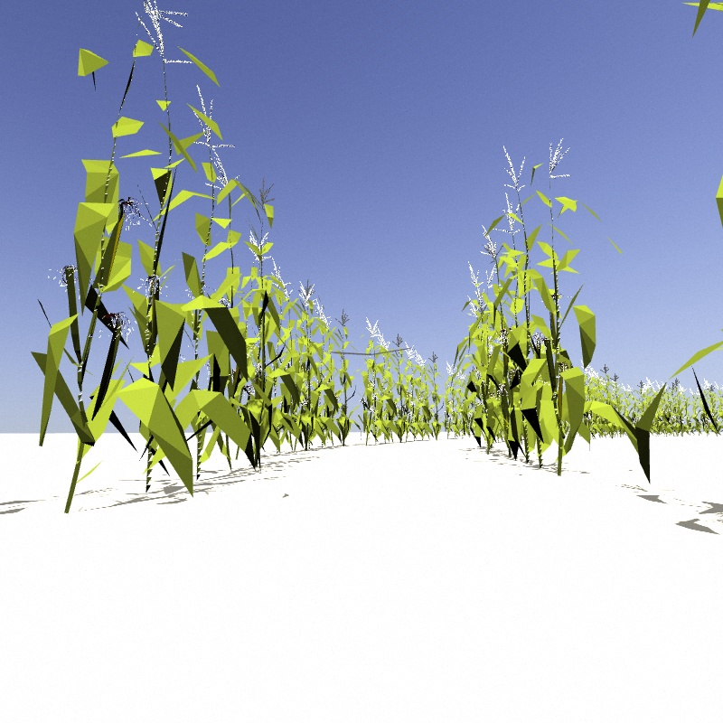
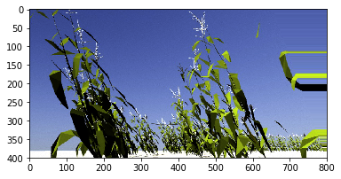
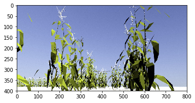
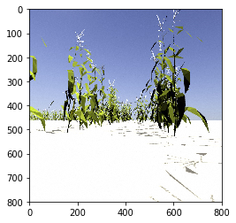
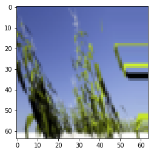
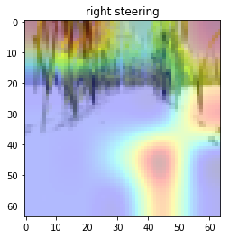
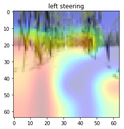
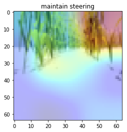

### Visual Navigation 

The objective of this project is to clone human aided teleoperation through unstructured environments using Deep Neural Networks. In order to achieve this, we are going to use a robot simulator that was designed in ROS-Gazebo. During the training phase, we navigate the robot inside the simulator using a joystick. While we navigate the robot, the simulator records a ROSBag which contains the steering angle and corresponding images. This serves as data for our Deep Neural Network. 

### Dependencies

This project requires **Python 3.5** and the following Python libraries installed:

- [Keras](https://keras.io/)
- [NumPy](http://www.numpy.org/)
- [SciPy](https://www.scipy.org/)
- [TensorFlow](http://tensorflow.org)
- [Pandas](http://pandas.pydata.org/)
- [OpenCV](http://opencv.org/)
- [Matplotlib](http://matplotlib.org/) (Optional)
- [Jupyter](http://jupyter.org/) (Optional)

## Implementation

### Data Capturing

During the training, the simulator captures data with a frequency of 15 fps. At a given time step it records one image taken from camera mounted on the front of the robot. The following figure shows an example I have collected during the training time.

Dataset Sample Image
-----

Collected data are processed before feeding into the deep neural network and those preprocessing steps are described in the latter part of this file. 

### Dataset Statistics
The dataset consists of 794 images. The training track currently is pretty uniform(something I plan to change in the next version by adding steep turns and straight road segments). Hence, the majority of the recorded steering angles are zeros. Therefore, preprocessing images and respective steering angles are necessary in order to generalize the training model for unseen tracks.

Next, we are going explain our data processing pipeline.

### Data Processing Pipeline
In the very first stage of the pipeline, we apply random shear operation. However, we select images with 0.9 probability for the random shearing process. We kept 10 percent of original images and steering angles in order to help the car to navigate in the training track. The following figure shows the result of shearing operation applied to a sample image.

 

The images captured by the simulator come with a lot of details which do not directly help model building process.  In addition to that extra space occupied by these details required additional processing power. Hence, we remove 35 percent of the original image from the top and 10 percent. This process was done in crop stage. The following figure shows the result of cropping operation applied to an image.

 

The next stage of the data processing pipeline is called random flip stage. In this stage we randomly (with 0.5 probability) flip images. The idea behind this operation is left turning bends are more prevalent than right bends in the training track. Hence, in order to increase the generalization of our mode, we flip images and respective steering angles. The following figure shows the result of flipping operation applied to an image.

 

In the final state of the pipeline, we resize images to 64x64 in order to reduce training time. A sample resized image is shown in the following figure. Resized images are fed into the neural network. The following figure shows the result of resize operation applied to an image.

 

### Visualizing Network
As can be seen, the model learns to look at different parts of the image for the three decisions on whether to turn left, right or maintain steering and the heatmaps are intuitive for their corresponding control actions. 

 

 

 

